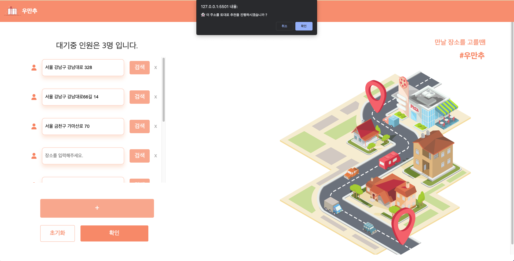

# 우만추(Umanchu)(우리의 만남을 추천)

## 프로젝트 주제 : 네이버 map 데이터 및 지도 API를 활용한 만날 장소와 먹거리, 놀거리 추천 시스템

### **조원 : 이현민, 정준영, 김범석,박민규**

- 역할
    - 이현민(조장) : 환경 구축, 데이터 수집 및 전처리, DB구축
    - 박민규(조원) : 추천 시스템 구축, 웹 구현(back-end)
    - 정준영(조원) :  환경 구축, 웹 구현(back-end)
    - 김범석(조원) :  웹 디자인, 웹 구현(front-end)
    
- 프로젝트 구상
    1. 어디서 볼지 애매할 때
    2. 만나는 장소를 고민 하거나 선택하기 어려움.
    3. 만나는 사람과 거리가 합리적인 장소를 나타내고 싶음. 
    4. 만나는 장소에서 유명한 맛집이 어디인 지 나타내고 싶음.
    5. 맛집 말고 다른 놀만한 장소도 보여주고 싶음. 
    
- 프로젝트 목표
    - 여러 명의 주소 입력 시 중간 지점 근처 역 제공
    - 사용자가 선택한 카테고리 기반 장소 추천
    - 장소 정보 제공
    - 장소에 대한 길찾기 서비스 제공
    
- 프로젝트 구조
    1. 사용자 및 만날 사람의 주소 입력
    2. 중간 지점 근처 역 제공
    3. 먹거리/놀거리 카테고리 선택
    4. 선택된 카테고리 기반 장소 추천
    
- 프로젝트 기대효과
    1. 합리적인 장소를 제공
    2. 장기간의 거리두기로 인한 약속 장소 정보 부족 해소
    3. 생소한 위치의 먹거리/놀거리 정보 제공
    4. 세세한 카테고리 분류로 사용자의 주관적 선택에 도움
    
- 사용 기술 스택
    - 개발 환경
        - VS Code, Eclipse, Jupyter, EC2, Linux
    - 프레임워크
        - AWS(S3,Lambda,Emr,Spring,Docker,Airflow)
    - 사용 언어
        - HTML,CSS,JavaScript,Python,Java,Jquery
    - 데이터 베이스
        - RDS(MySQL)
        
- 프로젝트 수행 및 절차방법
    1. WBS(업무 분업 구조)
    2. 시스템 아키텍처
    3. 요구사항 정의서
    4. api 정의서
    5. 추천 알고리즘 정의서
    
- SYSTEM ARCHITECTURE
    
    
    

- 기능 구현 및 개발
    1. 데이터 파이프라인
        
        
        
        - 데이터 수집
            - Airflow에서 Trigger 발생을 위해 지하철역 목록 파일을 s3에 업로드 하고 이로 인해 객체 생성 이벤트가 발생하여 aws lambda에서 네이버 map 데이터를 크롤링하고 s3에 크롤링한 데이터를 업로드
                
                
                
        - 데이터 전처리 및 모델링
            - Airflow에서 Emr 마스터노드에 ssh 접속을 하여 bash operator를 이용해 명령어를 입력하는 방식을 사용
                
                
                
        
    2. 웹 서비스
        
        
        
        - Web Server 구성
            - AWS EC2의 아마존 Liunx2 기반 위에 Docker의 Container를 이용해 Spring의 Tomcat을 올린 구조
        - Web 구현 기능
            - 먹거리 / 놀거리 추천 서비스
            AWS RDS MySQL에서 추천된 데이터를 불러와서 Web에 게시
            - 중간 지점 탐색 서비스
            사용자들이 입력한 주소의 중간지점에 해당하는 위치를 계산
            - 빠른길 찾기 / 지도 서비스 [ 구글 API ]
                - Google Direction API - 대중교통 기반으로 빠른길 찾는 기능 함수화
                - Google Place API - 특정 지점을 기반으로 근처에 지정한 시설을 검색하는 기능 함수화
                - Google Static Map API - 일반 지도 표시 및 마커 표시 기능 함수화
                - Google Geocoding API - 주소를 위도 경도로 변환 기능 함수화
- 구현
    
    
    
    
    
    
    
    
    
    
    
    
    
    
    
    
    
    
    

- 아쉬운점
    1. 서울시 내에 국한되지 않고 더 다양한 데이터를 수집해 사용자에게 더욱 방대한 정보를 제공해주고 싶습니다.
    2. 다음 번엔 회원가입 시스템을 만들고 그에따른 사용자의 데이터를 기반으로 협업 필터링 추천 시스템을 만고 싶습니다.
    3. 사용자 선택 데이터를 수집해서 추가적인 추천 알고리즘 운영에 도움이 되는 시스템 구조를 꾸려보고 싶습니다.
    4. 프로젝트의 주제가 웹보다는 모바일의 접근성이 더 좋다보니 네이티브나, 크로스 플랫폼 혹은 반응형을 통해 모바일 접근성을 높여 사용자에게 친숙하게 다가가고 싶습니다.